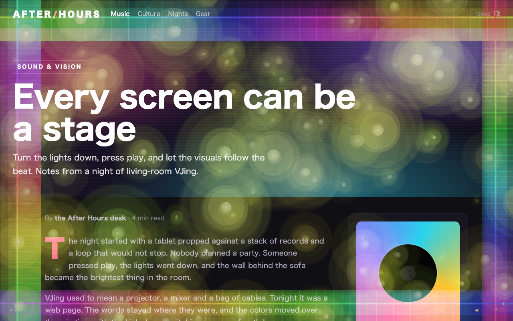
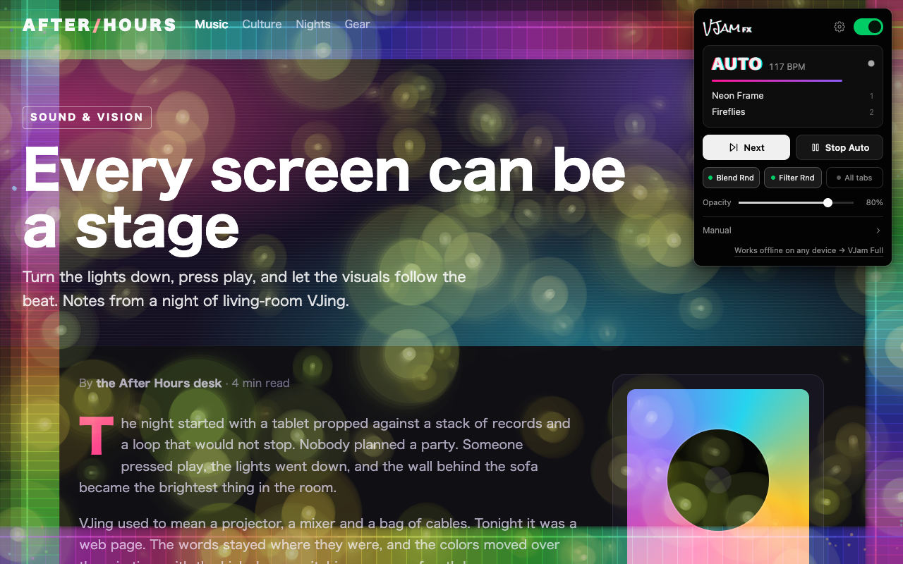
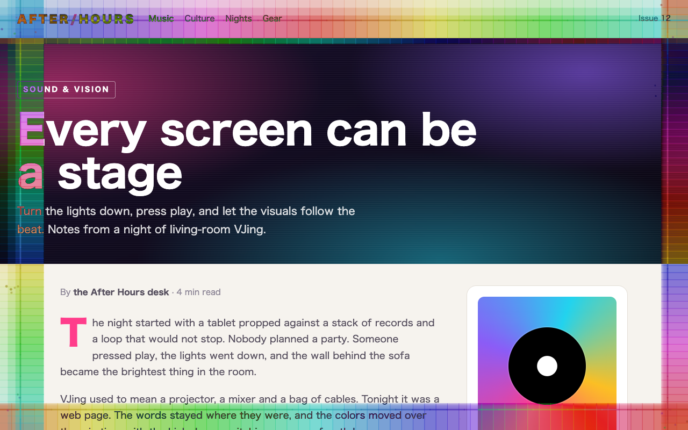
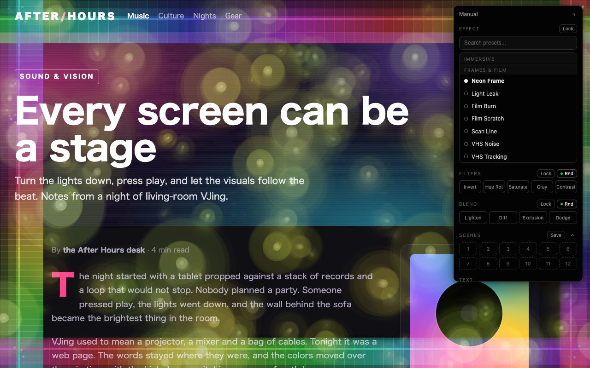
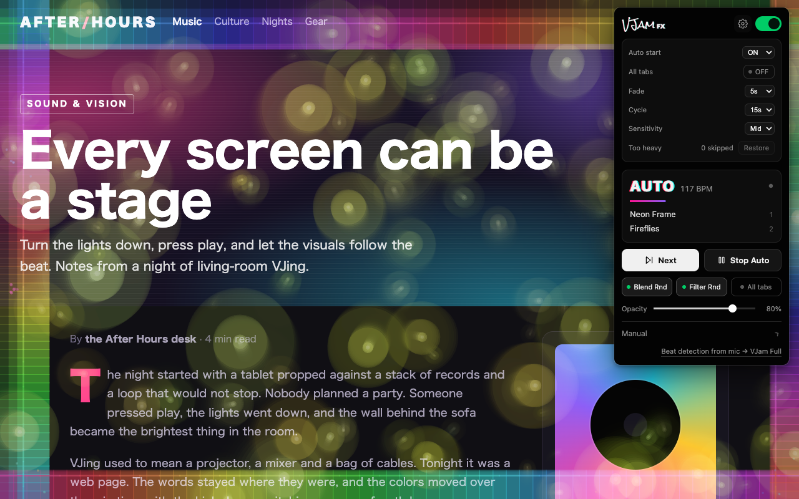

# VJam FX — VJ Effects for Any Website

Chrome extension that overlays music-reactive VJ visuals on any webpage. Open a page with a video or music, turn VJam FX on, and the effects follow the beat.

**Website**: https://infohiroki.github.io/vjam-fx/



| | |
|---|---|
|  |  |
| Auto mode: BPM and the layers on screen | On light pages, the blend adapts automatically |
|  |  |
| Manual: effects, filters, blend and 12 scenes | Settings: Auto start, All tabs, fade, cycle, sensitivity |

## Features

- **370 visual effects** in 13 categories — neon tunnels, kaleidoscopes, particles, aurora, glitch, plasma and more
- **Beat detection**: reads the sound of the video or music on the page and finds the BPM — no microphone needed
- **Auto mode**: every 15 seconds, on the beat, it adds, swaps or clears one effect at a time — starting from one, building up to 3, then breaking back down — with 5-second fades and random blend modes & filters
- **Next**: a fresh combination of effects with one click — Auto carries on from there
- **Default pool**: Next / Auto pick from a curated pool of 331 effects (`content/default-pool.json`). Any of the 370 can be chosen by hand
- **Layers**: stack up to 5 effects and mix them with blend modes (Lighten, Difference, Exclusion, Dodge; default Screen)
- **Filters**: Invert, Hue Rotate, Saturate, Grayscale, Contrast
- **Blend Rnd / Filter Rnd**: randomize blend modes and filters (with or without Auto)
- Adjustable **opacity, fade time, cycle length and sensitivity**
- **12 scenes**: save your favorite combinations and recall them instantly
- **Text**: put your own words on screen with animated fonts and colors
- **All tabs**: the effects follow you to the tab you switch to or open
- **Navigation persistence**: effects stay on as you move between pages of the same site (Service Worker)
- **Light page detection**: the blend adapts automatically on light-themed pages
- **Heavy effects skipped**: effects too heavy for the computer are left out automatically (`N skipped` in the popup, Restore in the settings)
- **On-demand injection**: p5.js, the engine and the effects are injected only when you turn VJam FX on

## Install (Development)

1. Clone this repo
2. `npm install`
3. Open `chrome://extensions/`
4. Enable "Developer mode"
5. Click "Load unpacked" and select this folder
6. Click the VJam FX icon on any webpage

## Usage

1. Open a page with a video or music and play it
2. Click the VJam FX icon in the toolbar (first time: pin VJam FX from the Extensions menu)
3. Turn the switch on — Auto starts right away (Auto start in the settings)

| Control | Behavior |
|---------|----------|
| **ON / OFF** | Turn the effects on the current tab on or off |
| **Stage** | `AUTO` / `MANUAL` / `OFF`, the BPM (when detected) and the layers on screen |
| **Next** | Random 1–3 effects. If Auto is on, Auto carries on from them |
| **Auto** / **Stop Auto** | Build up and swap effects one step at a time (Cycle seconds, on the beat) |
| **Blend Rnd** / **Filter Rnd** | Randomize blend modes / filters (independent of Auto; turned on with Auto) |
| **All tabs** | Keep the effects on the tab you switch to or open |
| **Opacity** | Effect opacity |
| **Manual** | Effect list (search, Lock), Filters, Blend, Scenes (Save / click to load / right-click to clear), Text, Reset, Audio |
| **Settings** (gear) | Auto start, All tabs, Fade, Cycle, Sensitivity, Too heavy (Restore) |

## Safari (iPad)

Coming soon to the App Store. Built from the same source — see [`safari/README.md`](safari/README.md) for the build steps.

## Development

```bash
npm install
npm test            # Vitest + jsdom (4068 tests)
npm run test:watch  # Watch mode
npm run test:e2e    # Playwright: loads the real extension in Chromium and drives the popup (103 tests)
npm run package     # Chrome Web Store zip → dist/ (see store/README.md)
```

## Architecture

```
vjam-fx/
├── manifest.json          # Manifest V3
├── background/
│   └── service-worker.js  # State persistence across page navigations, All tabs
├── popup/                 # Extension popup UI
│   ├── popup.html         # Stage, Next / Auto, chips, Manual, settings
│   ├── popup.css          # Dark theme UI
│   ├── popup.js           # Controller (injects via chrome.scripting)
│   └── lockup.png         # Logo
├── content/               # Injected into pages (MAIN world)
│   ├── content.js         # VJamFXEngine — overlay, multi-layer, filters, Auto
│   ├── base-preset.js     # Base class for all presets
│   ├── audio-bridge.js    # ISOLATED world — SW→MAIN audioData relay
│   ├── mse-tap.js         # Safari only — beat detection from MediaSource audio
│   ├── text-overlay.js    # Text effects overlay
│   ├── default-pool.json  # Default pool for Next / Auto / Rnd (331 effects)
│   └── presets/           # 370 visual presets (IIFE pattern)
├── offscreen/             # Offscreen document for tabCapture audio
├── lib/p5.min.js          # p5.js graphics engine
├── icons/                 # Extension icons (16/32/48/128px)
├── safari/                # Safari (iPad) app — Xcode project
├── store/                 # Chrome Web Store / App Store listing, screenshots
├── docs/                  # Website (GitHub Pages): LP, support, privacy policy
├── scripts/               # Packaging and Safari build scripts
├── tools/                 # Default pool curation and benchmarks
├── test/                  # Vitest + jsdom tests
└── tests/e2e/             # Playwright tests (real extension in Chromium)
```

### Preset Categories

| Category | Count | Examples |
|----------|-------|---------|
| Immersive | 44 | Neon Tunnel, Laser Tunnel, Infinite Zoom, Hypnotic, Wormhole |
| Frames & Film | 19 | Neon Frame, Light Leak, Film Burn, Film Scratch, Scan Line |
| Patterns | 49 | Kaleidoscope, Mandala, Sacred Geometry, Moire, Prism |
| Organic | 47 | Cellular, Liquid, Voronoi, Smoke |
| Nature | 22 | Fractal Tree, Flower Bloom, Autumn Fall, Dandelion Seeds, Petal Storm |
| Water | 22 | Water Surface, River Stream, Waterfall Mist, Tide Wave, Tide Pool |
| Grid & Tech | 32 | Glitch Grid, Hexgrid Pulse, Grid Warp, Gravity Cloth, Circuit Board |
| Space | 25 | Starfield, Constellation, Deep Nebula, Bokeh, Terrain |
| Neon & Glow | 25 | Neon 80s, Neon Bars, Neon Dust, Neon Jellyfish, Neon Smoke |
| Glitch & Retro | 31 | Glitch 8bit, Glitch Wave, Cyber Glitch, Digital Noise, Corrupted Archive |
| Audio Reactive | 32 | Frequency Rings, Equalizer, Sine Waves, Ridge Lines, Gradient Sweep |
| Particles | 14 | Snowfall, Confetti Burst, Hanabi Dusk, Particle Storm, Dust Motes |
| Weather | 8 | Rain, Neon Rain, Cyber Rain, Ceiling Drip, Rain Window |

## Permissions

- **activeTab** — access to current tab only when user clicks the icon
- **scripting** — inject p5.js and engine into the page
- **webNavigation** — maintain visual effects across page navigations
- **tabCapture** — capture tab audio for beat detection (fallback when video element audio is unavailable)
- **offscreen** — create offscreen document for tab audio processing
- **storage** — save scenes, settings and extension state
- **Optional host permission `<all_urls>`** — requested only when you turn on All tabs

## Tech Stack

- Vanilla JavaScript (IIFE pattern, no bundler)
- p5.js for 2D canvas graphics
- Web Audio API for video/tab audio frequency analysis
- Chrome Extension Manifest V3
- Vitest + jsdom, Playwright for testing

## License

ISC

---

**[Get VJam Full](https://vjam.art)** — Full VJ system with HDMI output, mic input, GLSL shaders, and more.
